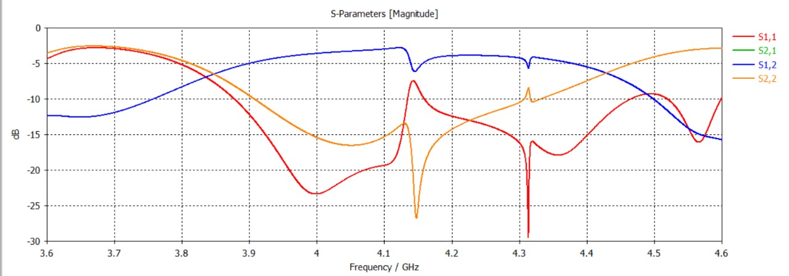

# 🎛️ Hairpin Bandpass Filter Design (CST Studio Suite)

[]()
[]()
[](LICENSE)

An intermediate-level **hairpin microstrip bandpass filter** designed and simulated in **CST Studio Suite**, using folded (U-shaped) half-wavelength resonators coupled in parallel to achieve a compact bandpass response.

## 📋 Table of Contents
- [Overview](#overview)
- [Design Specifications](#design-specifications)
- [Simulation Results](#simulation-results)
- [Repository Structure](#repository-structure)
- [Tools Used](#tools-used)
- [Future Work](#future-work)
- [License](#license)

## Overview

Hairpin filters fold conventional parallel-coupled half-wavelength resonators into a "U" shape, reducing the overall filter footprint while preserving bandpass characteristics. This design was modeled and simulated in CST Microwave Studio to evaluate its return loss (S11), insertion loss (S21), and passband behavior.

## Design Specifications

| Parameter | Value |
|---|---|
| Design Software | CST Studio Suite |
| Filter Type | Hairpin (folded parallel-coupled line) bandpass |
| Resonator Structure | Two folded microstrip strip pairs |
| Simulated Sweep | 3.6 GHz – 4.6 GHz |
| Observed Passband | ≈ 4.1 GHz – 4.3 GHz |

> Update substrate, dielectric constant, and exact dimensions above to match your `.cst` model.

## Simulation Results

Full results with commentary are documented in **[RESULTS.md](RESULTS.md)**.

**Filter Geometry:**


**S-Parameters (Magnitude):**



The filter shows strong return loss dips near **4.14 GHz** and **4.32 GHz**, indicating a bandpass response centered around this range, with S21 (transmission) rising within the passband and S11 (reflection) dropping sharply at resonance.

## Repository Structure

```
├── README.md              # Project overview (this file)
├── RESULTS.md              # Detailed simulation results
├── CHANGELOG.md             # Version history
├── LICENSE
├── .gitignore
└── images/
    ├── filter_geometry.png
    └── s_parameters.jpeg
```

## Tools Used

- **CST Studio Suite** (Microwave Studio) for EM simulation
- S-Parameter (Frequency Domain) solver

## Future Work

- [ ] Passband ripple and insertion-loss optimization
- [ ] Group delay analysis
- [ ] Fabrication and VNA measurement validation
- [ ] Miniaturization / footprint reduction study

## License

Released under the [MIT License](LICENSE).
