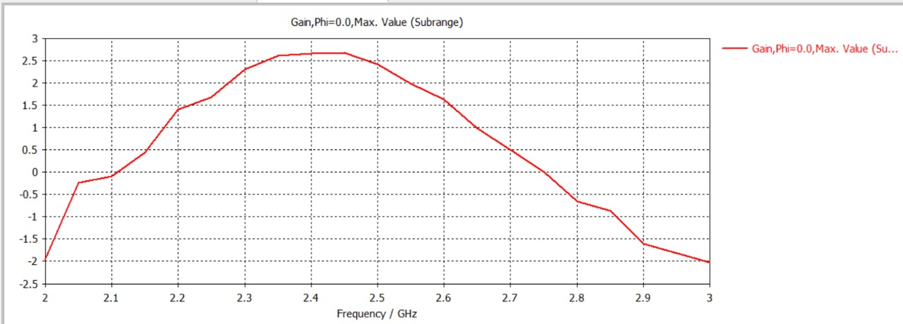

# 📊 Results — Microstrip Patch Antenna

## Simulation Environment

- **Software:** CST Studio Suite
- **Solver:** Frequency Domain / Far-field monitor
- **Sweep Range:** 2 GHz – 3 GHz

## Gain vs. Frequency

*Gain, Phi = 0.0°, Max. Value (Subrange), 2–3 GHz sweep.*

| Frequency (GHz) | Approx. Gain (dB) |
|---|---|
| 2.00 | -1.9 |
| 2.20 | 1.4 |
| 2.35 | 2.6 |
| **2.40** | **≈ 2.67 (peak)** |
| 2.45 | 2.65 |
| 2.60 | 1.6 |
| 2.80 | -0.7 |
| 3.00 | -2.1 |

## Observations

- The antenna exhibits a clear single resonance peak with **maximum gain of ≈ 2.67 dB around 2.35–2.45 GHz**, aligning well with the intended 2.4 GHz ISM band target.
- The gain rolls off fairly symmetrically outside the passband, dropping below 0 dB beyond roughly 2.05 GHz and 2.75 GHz.
- The flat top between 2.35–2.45 GHz suggests good gain stability across the useful operating band, which is favorable for Wi-Fi/Bluetooth applications that span the full 2.4 GHz channel range.

## Conclusion

The simulated microstrip patch antenna performs as expected for a 2.4 GHz ISM-band design, with a well-defined gain peak in the target band. Further validation via return loss (S11) and radiation pattern plots is recommended before fabrication.
